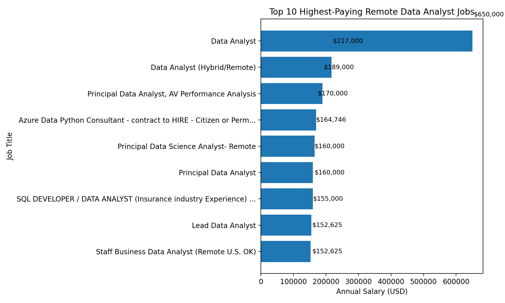
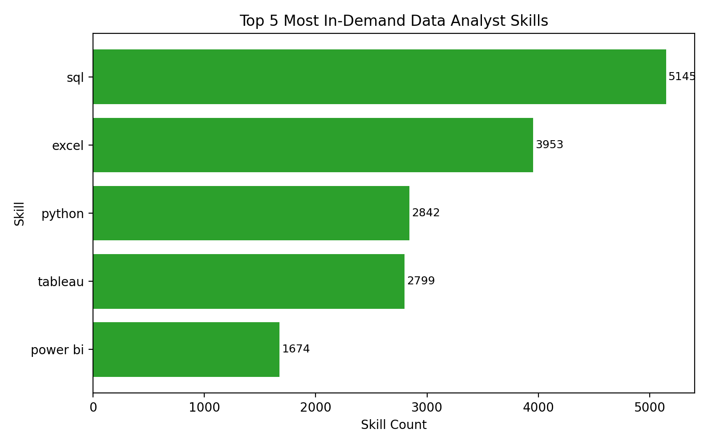
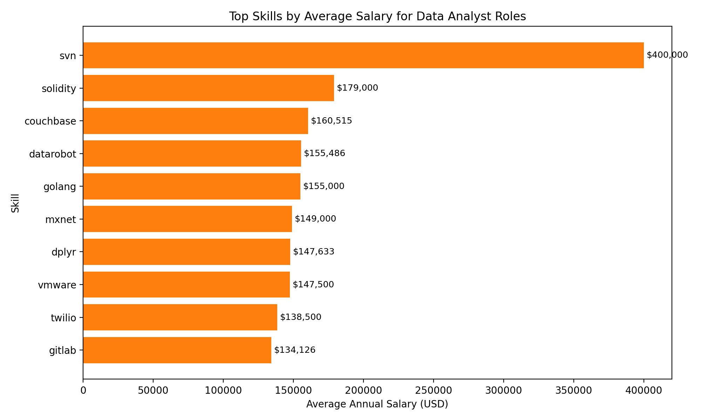
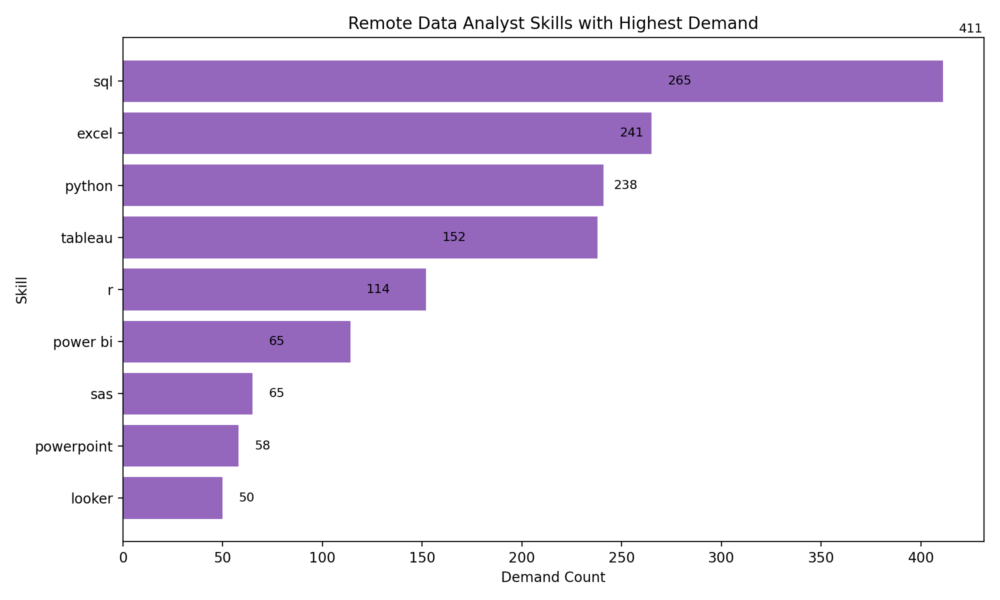

# 📊 Data Job Analysis SQL Project

<div align="center">
  
  
  
</div>

A professional SQL portfolio project analyzing remote Data Analyst job postings, salary trends, and skill demand across the data job market.

## Introduction
This project uses SQL to explore real job market data and answer questions that matter to both employers and candidates. The analysis focuses on Data Analyst opportunities, with attention to salary, work arrangement, and technical skill requirements.

The goal is not only to query the data, but to interpret it in a business-relevant way. By connecting job postings, company information, and skill requirements, the project demonstrates how SQL can support hiring, market research, and career planning decisions.

## Background
The dataset includes structured information on job postings, related companies, and required skills. It contains fields such as:

- job title and job type
- company name
- work location and remote status
- posted date
- annual salary
- associated skills

This allows the analysis to answer questions such as which Data Analyst roles pay the most, which skills are most frequently requested, and which skill combinations are associated with higher salaries.

## Business Questions
This project addresses the following business and data questions:

- Which remote Data Analyst jobs offer the highest annual salaries?
- Which skills appear most frequently in Data Analyst job postings?
- Which skills are associated with the highest average salaries?
- Which skills appear most often in remote Data Analyst roles with available salary data?

## 🛠️ Tools & Technologies

- PostgreSQL for database creation and SQL analysis
- SQL for querying, aggregation, filtering, and data joins
- CSV files as project data sources
- CTEs and subqueries to structure analysis logic
- Data modeling through job, company, and skill relationships
- Python + Matplotlib for generating project charts and portfolio visuals

## 📈 Analysis & Results

### 1️⃣ Top Paying Remote Data Analyst Jobs

**Business Question**
Which remote Data Analyst jobs offer the highest annual salaries?

**SQL Query**
```sql
-- Return the ten highest-paying remote Data Analyst jobs.
SELECT
    job_id,
    job_title,
    company.name AS company_name,
    job_location,
    job_schedule_type,
    salary_year_avg,
    job_posted_date

FROM
    job_postings_fact AS job_postings

LEFT JOIN company_dim as company ON job_postings.company_id = company.company_id

WHERE
    job_title_short = 'Data Analyst' AND
    job_location = 'Anywhere' AND
    salary_year_avg IS NOT NULL

ORDER BY
    salary_year_avg DESC

LIMIT 10;
```

**Results**
The table below shows the actual output from the project data for the top 10 remote Data Analyst jobs by annual salary.

| job_id | job_title | company_name | job_location | job_schedule_type | salary_year_avg | job_posted_date |
|---:|---|---|---|---|---:|---|
| 27020 | Data Analyst | Mantys | Anywhere | Full-time | 650000.0 | 2023-02-21 |
| 101959 | Data Analyst (Hybrid/Remote) | Uclahealthcareers | Anywhere | Full-time | 217000.0 | 2023-01-17 |
| 47609 | Principal Data Analyst, AV Performance Analysis | Motional | Anywhere | Full-time | 189000.0 | 2023-01-05 |
| 10112 | Azure Data Python Consultant - contract to HIRE - Citizen or Perm... | Kelly Science, Engineering, Technology & Telecom | Anywhere | Contractor | 170000.0 | 2023-01-24 |
| 92799 | Principal Data Science Analyst- Remote | Mayo Clinic | Anywhere | Full-time | 164746.0 | 2023-01-14 |
| 87959 | SQL DEVELOPER / DATA ANALYST (Insurance industry Experience) ... | Robert Half | Anywhere | Full-time | 160000.0 | 2023-01-30 |
| 12388 | Principal Data Analyst | Realtime Recruitment | Anywhere | Full-time | 160000.0 | 2023-02-03 |
| 9985 | Lead Data Analyst | Motion Recruitment | Anywhere | Full-time | 155000.0 | 2023-01-06 |
| 77064 | Staff Business Data Analyst (Remote U.S. OK) | Zscaler | Anywhere | Full-time | 152625.0 | 2023-03-08 |
| 36613 | Staff Business Data Analyst (Remote U.S. OK) | Zscaler | Anywhere | Full-time | 152625.0 | 2023-03-12 |

**Visualization**



**Key Insight**
The analysis shows that the highest-paying remote Data Analyst roles in this dataset reach $650,000 annually, while multiple roles exceed $150,000. This indicates that remote Data Analyst opportunities include a wide range of salary levels, with some senior and specialized roles substantially above the median.

---

### 2️⃣ Top Skills Associated with the Highest-Paying Jobs

**Business Question**
Which skills appear most often in the highest-paying remote Data Analyst roles?

**SQL Query**
```sql
-- Identify the ten highest-paying remote Data Analyst jobs.
WITH top_paying_jobs AS (
    SELECT
        job_id,
        job_title,
        job_location,
        salary_year_avg,
        company.name AS company_name

    FROM
        job_postings_fact AS job_postings

    LEFT JOIN company_dim AS company
        ON job_postings.company_id = company.company_id

    WHERE
        job_title_short = 'Data Analyst'
        AND job_location = 'Anywhere'
        AND salary_year_avg IS NOT NULL

    ORDER BY
        salary_year_avg DESC

    LIMIT 10
)

SELECT
    top_paying_jobs.*,
    skills

FROM top_paying_jobs

INNER JOIN skills_job_dim
    ON top_paying_jobs.job_id = skills_job_dim.job_id

INNER JOIN skill_dim AS skills
    ON skills_job_dim.skill_id = skills.skill_id

ORDER BY
    salary_year_avg DESC;
```

**Results**
A subset of the actual output is shown below to highlight the most relevant skills linked to the selected highest-paying jobs.

| job_id | job_title | salary_year_avg | company_name | skill_id | skills |
|---:|---|---:|---|---:|---|
| 101959 | Data Analyst (Hybrid/Remote) | 217000.0 | Uclahealthcareers | 32 | crystal |
| 101959 | Data Analyst (Hybrid/Remote) | 217000.0 | Uclahealthcareers | 188 | flow |
| 101959 | Data Analyst (Hybrid/Remote) | 217000.0 | Uclahealthcareers | 73 | oracle |
| 101959 | Data Analyst (Hybrid/Remote) | 217000.0 | Uclahealthcareers | 2 | sql |
| 101959 | Data Analyst (Hybrid/Remote) | 217000.0 | Uclahealthcareers | 160 | tableau |
| 47609 | Principal Data Analyst, AV Performance Analysis | 189000.0 | Motional | 191 | atlassian |
| 47609 | Principal Data Analyst, AV Performance Analysis | 189000.0 | Motional | 190 | bitbucket |
| 47609 | Principal Data Analyst, AV Performance Analysis | 189000.0 | Motional | 204 | confluence |
| 47609 | Principal Data Analyst, AV Performance Analysis | 189000.0 | Motional | 187 | git |
| 47609 | Principal Data Analyst, AV Performance Analysis | 189000.0 | Motional | 203 | jira |

**Visualization**
No chart was created for this query because it is a job-to-skill detail table rather than a single ranked metric. A chart would be less informative for this type of output, and the dataset is better interpreted as a skill mapping view.

**Key Insight**
This analysis shows that the highest-paying roles often include a mix of business tools, technical platforms, and core data skills. For example, SQL and Tableau appear in the top-paying Data Analyst job profile shown here, while some senior roles also list tools such as Jira, Git, and Atlassian products.

---

### 3️⃣ Most In-Demand Skills in Data Analyst Job Postings

**Business Question**
Which skills appear most often across Data Analyst job postings?

**SQL Query**
```sql
-- Count how often each skill appears across Data Analyst job postings.
WITH remote_job_skills AS (
    SELECT
        skill_id,
        COUNT(*) AS skill_count

    FROM
        skills_job_dim AS skills_to_job

    INNER JOIN job_postings_fact AS job_postings
        ON job_postings.job_id = skills_to_job.job_id

    WHERE
        job_postings.job_title_short = 'Data Analyst'

    GROUP BY
        skill_id
)

SELECT
    skills.skill_id,
    skills AS skill_name,
    skill_count

FROM remote_job_skills

INNER JOIN skill_dim AS skills
    ON skills.skill_id = remote_job_skills.skill_id

ORDER BY
    skill_count DESC
LIMIT 5;
```

**Results**
| skill | count |
|---|---:|
| sql | 5145 |
| excel | 3953 |
| python | 2842 |
| tableau | 2799 |
| power bi | 1674 |

**Visualization**



**Key Insight**
The analysis shows that SQL is the most frequently requested skill in Data Analyst postings, followed by Excel, Python, Tableau, and Power BI. This suggests that core business intelligence and analytics tools are consistently prominent in the job market.

---

### 4️⃣ Skills Associated with the Highest Average Salaries

**Business Question**
Which skills are associated with the highest average annual salaries in Data Analyst roles?

**SQL Query**
```sql
-- Average annual salary by skill for Data Analyst roles.
SELECT
    skills,
    ROUND(AVG(salary_year_avg), 2) AS avg_salary

FROM job_postings_fact

INNER JOIN skills_job_dim
    ON job_postings_fact.job_id = skills_job_dim.job_id

INNER JOIN skill_dim AS skills
    ON skills_job_dim.skill_id = skills.skill_id

WHERE
    job_title_short = 'Data Analyst' AND
    salary_year_avg IS NOT NULL

GROUP BY
    skills

ORDER BY
    avg_salary DESC
LIMIT 25;
```

**Results**
| skill | average_salary |
|---|---:|
| svn | 400000.0 |
| solidity | 179000.0 |
| couchbase | 160515.0 |
| datarobot | 155485.5 |
| golang | 155000.0 |
| mxnet | 149000.0 |
| dplyr | 147633.33333333334 |
| vmware | 147500.0 |
| twilio | 138500.0 |
| gitlab | 134126.0 |

**Visualization**



**Key Insight**
The analysis shows that several specialized or niche skills appear in the highest average salary group, even though they do not necessarily dominate overall demand. This indicates that salary outcomes can vary substantially by specialized tool sets and domain-specific technical skills.

---

### 5️⃣ Optimal Skills for Remote Data Analyst Roles

**Business Question**
Which skills are both common and strongly represented among remote Data Analyst jobs with available salary data?

**SQL Query**
```sql
-- CTE 1: Count how often each skill appears in remote Data Analyst jobs.
WITH skills_demand AS (
    SELECT
        skills_job_dim.skill_id,
        COUNT(skills_job_dim.job_id) AS demand_count

    FROM job_postings_fact

    INNER JOIN skills_job_dim
        ON job_postings_fact.job_id = skills_job_dim.job_id

    INNER JOIN skill_dim AS skills
        ON skills_job_dim.skill_id = skills.skill_id

    WHERE
        job_title_short = 'Data Analyst'
        AND salary_year_avg IS NOT NULL
        AND job_work_from_home = TRUE

    GROUP BY
        skills_job_dim.skill_id
),

average_salary AS (
    SELECT
        skills_job_dim.skill_id,
        skills.skills,
        ROUND(AVG(salary_year_avg), 2) AS avg_salary

    FROM job_postings_fact

    INNER JOIN skills_job_dim
        ON job_postings_fact.job_id = skills_job_dim.job_id

    INNER JOIN skill_dim AS skills
        ON skills_job_dim.skill_id = skills.skill_id

    WHERE
        job_title_short = 'Data Analyst'
        AND salary_year_avg IS NOT NULL
        AND job_work_from_home = TRUE

    GROUP BY
        skills_job_dim.skill_id,
        skills.skills
)

SELECT
    skills_demand.skill_id,
    average_salary.skills,
    skills_demand.demand_count,
    average_salary.avg_salary

FROM skills_demand

INNER JOIN average_salary
    ON skills_demand.skill_id = average_salary.skill_id

ORDER BY
    skills_demand.demand_count DESC;
```

**Results**
| skill_id | demand_count | skill | average_salary |
|---:|---:|---|---:|
| 2 | 411 | sql | 96802.04 |
| 157 | 265 | excel | 87016.12 |
| 0 | 241 | python | 101181.10 |
| 160 | 238 | tableau | 98705.29 |
| 1 | 152 | r | 100353.41 |
| 156 | 114 | power bi | 96753.89 |
| 162 | 65 | sas | 98751.53 |
| 7 | 65 | sas | 98751.53 |
| 164 | 58 | powerpoint | 88916.61 |
| 167 | 50 | looker | 103169.39 |

**Visualization**



**Key Insight**
The analysis shows that SQL, Excel, Python, Tableau, and Power BI are the most frequently appearing skills in remote Data Analyst roles with salary data. It also suggests that skills such as Python, R, Tableau, and Looker appear in higher average salary bands compared to some more general spreadsheet-oriented tools.

---

## 📊 Overall Key Findings

- SQL is the most in-demand skill in the project dataset and appears most frequently in Data Analyst job postings.
- Excel and Python are also highly common and remain core analytical tools for Data Analyst roles.
- Tableau and Power BI are strongly represented in the market and appear in many job requirements.
- The highest-paying remote roles often include specialized or senior-level titles and a combination of technical and business tools.
- Salary differences are driven by a mix of role seniority, specialization, and the technical tools associated with the job.

## 📚 What I Learned
This project strengthened my understanding of core SQL and data analysis practices, including:

- JOINs between fact and dimension tables
- Aggregation with GROUP BY and AVG
- Filtering using WHERE and logical conditions
- Sorting and ranking with ORDER BY and LIMIT
- CTEs for organized multi-step analysis
- Comparing skill demand and salary outcomes using derived metrics
- Interpreting business-relevant insights from query results

The project also demonstrates how SQL can be used to connect data across tables and turn raw data into business-oriented insight.

## 📁 Project Structure

```text
Data-Job-Analysis/
├── README.md
├── advanced_sql/
│   ├── cases.sql
│   ├── dates.sql
│   ├── subqueries.sql
│   └── union_operators.sql
├── images/
│   ├── q1_top_paying_jobs.png
│   ├── q3_top_demanded_skills.png
│   ├── q4_top_skills_based_on_salary.png
│   └── q5_optimal_skills.png
├── project_sql/
│   ├── 1_top_paying_jobs.sql
│   ├── 2_top_paying_job_skills.sql
│   ├── 3_top_demanded_skills.sql
│   ├── 4_top_skills_based_on_salary.sql
│   └── 5_optimal_skills.sql
├── sql_load/
│   ├── 1_create_database.sql
│   ├── 2_create_tables.sql
│   └── 3_modify_tables.sql
└── .gitignore
```

## 🎯 Final Conclusion
This project demonstrates how SQL can be used to analyze the modern Data Analyst market with real, business-relevant questions. The results show that high-paying roles tend to combine strong technical capabilities with business understanding, while the most frequently requested skills are centered on SQL, Excel, Python, Tableau, and Power BI.

For a data analyst portfolio, the value of this project is not just the queries themselves, but the ability to transform raw job data into useful insights about compensation, demand, and skill strategy. It shows a practical application of SQL for market analysis and career-focused decision-making.

---

